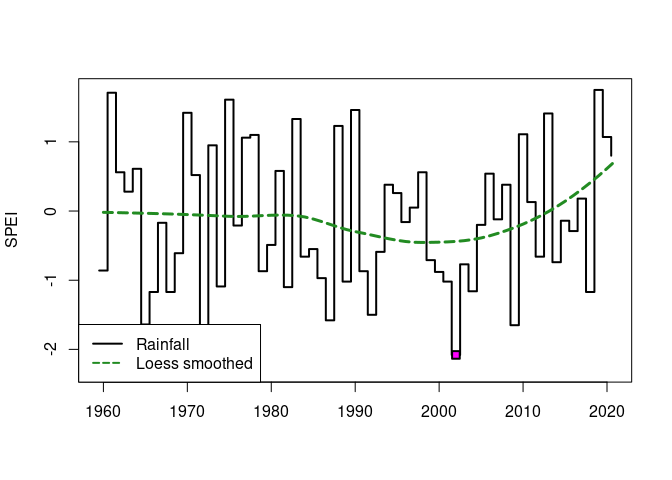
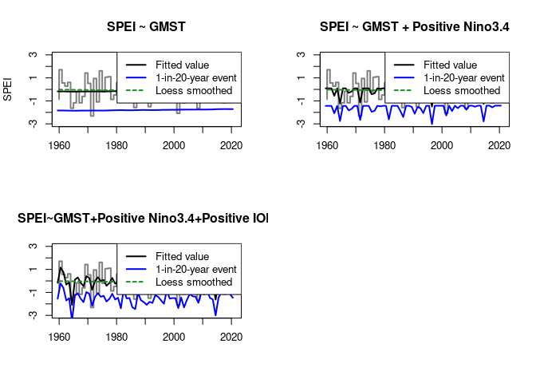
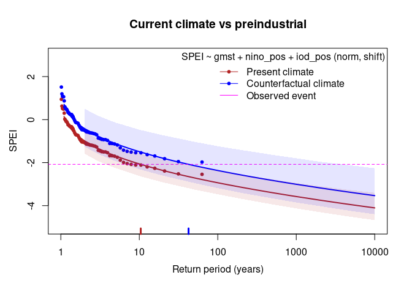
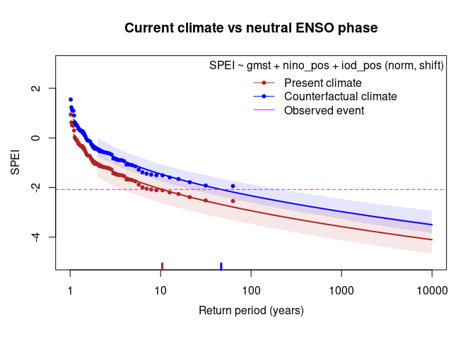
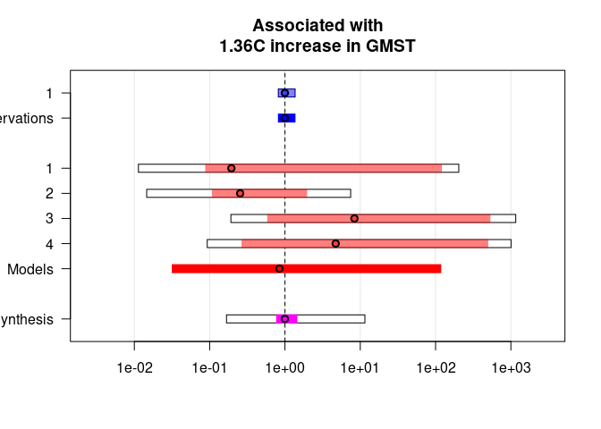
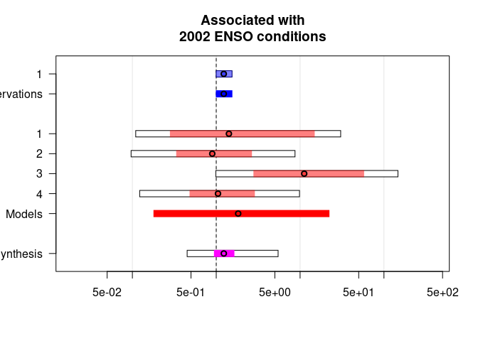

> **Note:** The analysis in this report follows the example analysis
> provided by the World Weather Attribution Github account
> (<https://github.com/WorldWeatherAttribution/rwwa_mwe>)

Event attribution allows us to assess the role that climate change plays
in the intensity, frequency, and duration of extreme weather events. By
quantifying this contribution, event attribution helps us understand how
natural and anthropogenic factors interact to shape the climate system.

The process typically involves comparing observed events to simulations
of a counterfactual world — a world without human-induced climate
change. By contrasting the occurrence of extreme events in the real
world with those in a simulated baseline, we can estimate the likelihood
and magnitude of the event being influenced by human activities.

In this notebook, we focus on the use of various climate variables to
explore the factors influencing drought in India. A major drought
occurred in India in 2002, with a rainfall deficit of 21.5% (Bhat,
2006). The variables utilised in this analysis include:

-   SPEI (Standardised Precipitation Evapotranspiration Index): This
    index measures the degree of drought or wetness in a region by
    comparing the balance between precipitation and evapotranspiration.
    A positive value indicates wet conditions, while a negative value
    indicates drought.

-   GMST (Global Mean Surface Temperature): GMST represents the average
    surface temperature of the Earth, providing a measure of global
    warming. In event attribution, this variable is often used to
    determine how much global warming may have influenced specific
    extreme events. The GMST data used here was accessed on the World
    Weather Attribution Github at:
    <https://github.com/WorldWeatherAttribution/rwwa_mwe/tree/main/ts>
    (December 2024).

-   IOD (Indian Ocean Dipole): The IOD is a climate phenomenon
    characterised by the difference in sea surface temperatures between
    the western and eastern parts of the Indian Ocean. It influences
    weather patterns, particularly in the Indian Ocean region and
    surrounding areas, including Southeast Asia and Australia.

-   SOI (Southern Oscillation Index): The SOI measures the difference in
    air pressure between Tahiti in the central South Pacific and Darwin
    in northern Australia. It is a key indicator of the El Niño-Southern
    Oscillation (ENSO), which significantly impacts global weather
    patterns. The SOI is used to track the intensity of El Niño and La
    Niña events. The Southern Oscillation Index data was accessed at:
    <http://www.bom.gov.au/climate/enso/soi/> (December 2024).

-   Nino3.4 Index: An index that represents the average sea surface
    temperature anomalies in a specific region of the equatorial Pacific
    Ocean (bounded approximately by 5°N-5°S and 170°W-120°W). This index
    is a key indicator of El Niño and La Niña events, which have
    significant impacts on global climate and weather patterns. The
    Nino3.4 Index data was accessed on the World Weather Attribution
    Github at:
    <https://github.com/WorldWeatherAttribution/rwwa_mwe/tree/main/ts>
    (December 2024).

By analysing the relationships between these variables and extreme
events, this notebook aims to investigate the potential links between
climate change and the occurrence of such events in the present and
future.

Event attribution is possible in R using the rwwa package
(<https://github.com/WorldWeatherAttribution/rwwa>).

    # Load the covariate data
    # We are examining data from 1960 to 2021, and so the GMST data is subsetted to match. 
    # The drought of interest occurred in 2002, and so we standardise the data around the 2002 value
    gmst <- read.table("~/EA_data/gmst.dat", col.names = c("year", "gmst"))
    gmst<-gmst[82:143,] 
    gmst$gmst <- gmst$gmst - gmst$gmst[gmst$year == 2002] # examining how the gmst may have differed in 2002

    # We are using the maximum SOI value per year, and subsetting the data to 1960-2012
    SouthernOscillationIndex<-read.csv("~/EA_data/Southern_Oscillation_Index.csv")
    SOI<-SouthernOscillationIndex %>% group_by(Year) %>% summarise(soi_max = max(SOI, na.rm = TRUE))
    SOI<-SOI[85:146,2]

    # Nino data is also subsetted to 1960-2012
    # As in the example at https://github.com/WorldWeatherAttribution/rwwa_mwe we are setting negative values of the Nino index to 0, as the SPEI is expected to be low during El Nino events, but  not necessarily higher in during La Nina events than during a neutral year.
    nino <- read.csv("~/EA_data/nino_6monthly.csv", col.names = c("year", "nino"))
    nino<-nino[107:168,]
    nino_pos <- nino[,2]
    nino_pos[nino_pos <= 0] <- 0

    # Taking the maximum monthly value of IOD as the annual value
    IndianOceanDipole <- read.csv("~/EA_data/IndianOceanDipole.csv")
    IOD<-IndianOceanDipole[91:152, 2:ncol(IndianOceanDipole)]
    IOD<-apply(IOD, 1, max)
    iod_pos <- IOD # Create a new column for positive IOD values
    iod_pos[IOD <= 0] <- 0 # Set negative IOD values to 0 (reflecting drier conditions during negative IOD)

    # Load time-series of interest
    SPEI<-read.csv("~/EA_data/indiaSPEI.csv")
    SPEI<-SPEI[,2]

    # combine into single dataframe
    df <-cbind.data.frame(gmst, IOD, SOI, nino_pos, iod_pos, SPEI)

Below we plot the SPEI values by year, including a Loess smoother
(Locally Estimated Scatterplot Smoothing) to fit a smoothed trend line
to the SPEI time series. This helps reveal underlying trends without
assuming a specific parametric model. We see a dip in the Loess smoother
below, corresponding to the drought event in 2002.

    # Plot the time series
    plot(df$year-0.5, df$SPEI, type = "s", lwd = 2, xlab = "", ylab = "SPEI", bg = "white")
    points(df[df$year == 2002,c("year", "SPEI")],pch = 22, bg = "magenta", lwd = 2, cex = 1.2) # add a point for the drought in 2002
    lines(df$year, fitted(loess(SPEI ~ year, df)), col = "forestgreen", lty = "32", lwd = 3)# add a simple Loess smoother to see if there is any trend over time
    legend("bottomleft", c("Rainfall", "Loess smoothed"), lty = c("solid","32"), lwd = 2, col = c("black", "forestgreen"))

#### Fitting Non-Stationary Distribution to the Data

We test several models: where SPEI depends only on GMST, IOD, positive
IOD, SOI, and Nino3.4 Index, respectively, and a final model where SPEI
depends on a combination of GMST, positive Nino3.4 index and positive
IOD.

    # Model fitting
    mdl_gmst <- fit_ns("norm", "shift", df, "SPEI", c("gmst"), lower = T)
    mdl_iod <- fit_ns("norm", "shift", df, "SPEI", c("gmst", "IOD"), lower = T)
    mdl_pos_iod <- fit_ns("norm", "shift", df, "SPEI", c("gmst", "iod_pos"), lower = T)
    mdl_soi <- fit_ns("norm", "shift", df, "SPEI", c("gmst", "soi_max"), lower = T)
    mdl_nino_pos <- fit_ns("norm", "shift", df, "SPEI", c("gmst", "nino_pos"), lower = T)
    mdl_nino_iod <- fit_ns("norm", "shift", df, "SPEI", c("gmst", "nino_pos", "iod_pos"), lower = T)

#### Comparing Fitted Models

We now compare the fitted models based on AIC values and explained
variance (*R*2 and adjusted *R*2) to see which
model fits the data better.

AIC (Akaike Information Criterion) is a measure of fit that penalises
model complexity. A lower AIC value indicates a better fit. The AIC is
calculated as:

*A**I**C* =  − 2*L* + 2*k*

where L is the log-likelihood and k is the number of parameters.

*R*2 is the Coefficient of Determination, and it measures the
proportion of variance in the response explained by the model. It ranges
from 0 (no variance explained) to 1 (perfect variance explained), and is
calculated as:

$$R^2 = 1-\frac{SS\_{res}}{SS\_{tot}}$$

where *SS**r**e**s* is the residual sum of squares and
*SS**t**o**t* is the total sum of squares.

The adjusted *R*2 improves upon *R*2 by adjusting
for the number of predictors in the model. This allows it to account for
overfitting, as it penalises unnecessary variables. It is calculated as:
$$R^2\_{adj}=1-\frac{(1-R^2)(n-1)}{n-k-1}$$
where n is the number of observations and k is the number of predictors.

In the results below, the model associated with the smallest AIC value
is the one in which SPEI is predicted using GMST, positive Nino3.4 and
positive IOD values. This indicates that, of the models examined, this
one provides the best fit. this is also the model with the highest
*R*2 and *R**a**d**j*2 values which
suggests that this model explains more of the variance in SPEI than the
other models (31% according to the *R*2 value and 27.5%
according to the adjusted *R*2 value).

    # Comparing models
    models <- list("gmst" = mdl_gmst, "IOD" = mdl_iod, "PosIOD"=mdl_pos_iod,"SOI"=mdl_soi,  "nino"=mdl_nino_pos, "nino_iod"=mdl_nino_iod)
    rbind("aic" = round(sapply(models, aic),1), round(sapply(models, rsquared),3))

    ##           gmst     IOD  PosIOD     SOI    nino nino_iod
    ## aic    183.100 183.500 183.700 176.700 174.500  164.200
    ## r2       0.002   0.028   0.026   0.129   0.159    0.311
    ## r2.adj  -0.015  -0.005  -0.008   0.100   0.131    0.275

    # Fitted models vs. observations
    # We can plot the fitted models against the observations to make sure they look reasonable.
    # We can also include a Loess smoother to see if the fitted model accurately replicates the trend over time.

    par(mfrow = c(2,2))

    plot_trend(mdl_gmst, xlab = "", ylab = "SPEI", ylim = c(-3,3), rp = c(20), add_loess = T, legend = "topright", main = "SPEI ~ GMST")
    plot_trend(mdl_nino_pos, xlab = "", ylab = "", ylim = c(-3,3), rp = c(20), add_loess = T, legend = "topright", main = "SPEI ~ GMST + Positive Nino3.4")
    plot_trend(mdl_nino_iod, xlab = "", ylab = "", ylim = c(-3,3), rp = c(20), add_loess = T, legend = "topright", main = "SPEI~GMST+Positive Nino3.4+Positive IOD")

#### Return Level Plots

A return level plot is used in event attribution to visualise the
probability of extreme climate events, such as heatwaves or heavy
rainfall, under different climate conditions. It helps answer: \* How
extreme was the observed event? \* How has the probability of such an
event changed due to climate change? \* How likely is this event in a
pre-industrial vs. present-day or future climate? The x-axis of these
plots displays the return period: The expected time interval (in years)
between occurrences of an event of a given magnitude. (e.g. A
1-in-100-year event (return period = 100) occurs, on average, once every
100 years). The y-axis displays the return level: The magnitude (e.g.,
temperature, rainfall) of the event corresponding to a given return
period.For a given return period, if the return level increases, events
of a given frequency are becoming more severe.

First, we define a ‘factual’ and ‘counter factual’ climate to compare
and visualise the difference between the observations if they’d occurred
at thos values of the covariates.

Our factual climate is defined as the climate of present-day (current
climate). Because we are examining an event that occurred in 2002, the
climate of 2002 is our factual climate.

For our counter factual climates, we examine a pre-industrial climate
(natural climate: expected climate without human-induced climate change)
and a neutral climate (one with a neutral ENSO phase).

    # our factual climate is determined by the values of the covariates in 2023
    cov_2002 <- df[df$year == 2002,c("gmst", "nino_pos", "iod_pos"),drop = F]

    # we can compare several counterfactual climates:
    cov_cf <- rbind("hist" = cov_2002 - c(1.36,0,0),# Preindustrial climate - approx 1.36C cooler than current climate
                    "neut" = cov_2002 * c(1,0,0)) #2002 climate with neutral ENSO phase

    # The rwwa R package provides a function for producing the return level plots, which can be run with plot_returnlevels(). I have taken the liberty of modifying it slightly so that it explicitly returns the values for the return levels and confidence intervals:

    plot_returnlevels <- function(mdl, cov_f, cov_cf, ev, seed = 42, nsamp = 500, model_desc = T,
                                  xlim = c(1,10000), ylim = NA, pch = 20, xlab = "Return period (years)", 
                                  ylab = NA, main = "", legend_pos = "topright", 
                                  legend_labels = c("Present climate", "Counterfactual climate")) {
      
      x <- mdl$x
      if(missing(ev)) { ev <- mdl$ev }
      
      rp_x <- unique(c(seq(1.1,2,0.1), seq(2,100,1), seq(100,1000,10), seq(1000,10000,1000)))   
      rp_th <- 1/seq(1,0,length.out = length(x)+2)[2:(length(x)+1)]  
      
      # Trim covariates if necessary
      if(nrow(cov_f) > 1) {
        warning("cov_f has more than one row: only first row will be used as factual covariates")
        cov_f <- cov_f[1,,drop = F]
      }
      if(nrow(cov_cf) > 1) {
        warning("cov_cf has more than one row: only first row will be used as counterfactual covariates")
        cov_cf <- cov_cf[1,,drop = F]
      }
      
      # Calculate return levels
      rl_curve_pres <- map_from_u(mdl, 1/rp_x, fixed_cov = cov_f)
      rl_curve_cf <- map_from_u(mdl, 1/rp_x, fixed_cov = cov_cf)
      
      rl_obs_pres <- map_from_u(mdl, map_to_u(mdl), fixed_cov = cov_f)
      rl_obs_cf <- map_from_u(mdl, map_to_u(mdl), fixed_cov = cov_cf)
      
      rp_event_pres <- 1/map_to_u(mdl, ev, fixed_cov = cov_f)
      rp_event_cf <- 1/map_to_u(mdl, ev, fixed_cov = cov_cf)
      
      # Store event return period values
      event_rp_values <- list(present = rp_event_pres, counterfactual = rp_event_cf)
      
      # Prep axes
      if(is.na(ylim[1])) { ylim <- range(pretty(c(x, rl_curve_pres, rl_curve_cf))) }
      if(is.na(ylab)) { ylab <- mdl$varnm }
      
      # Plot
      plot(0, type = "n", xlim = xlim, ylim = ylim, log = "x", xlab = "", ylab = "", main = main)
      mtext(xlab, side = 1, line = 2.5, cex = par("cex.lab"))
      mtext(ylab, side = 2, line = 2.5, cex = par("cex.lab"))
      
      # Add legend
      legend_title <- if (model_desc) paste0(mdl$varnm, " ~ ", paste0(mdl$covnm, collapse = " + "), " (",mdl$dist, ", ", mdl$type, ")") else ""
      legend(legend_pos, legend = c(legend_labels, "Observed event"), col = c("firebrick", "blue", "magenta"), 
             lty = 1, pch = c(pch, pch, NA), bty = "n", cex = par()$cex.lab, title = legend_title)
      
      # Plot return period curves
      lines(rp_x, rl_curve_pres, lwd = 2, col = "firebrick", lty = 1)    
      lines(rp_x, rl_curve_cf, lwd = 2, col = "blue", lty = 1) 
      
      # expected return periods vs return levels transformed to stationarity at that covariate value
      points(rp_th, sort(rl_obs_pres, decreasing = mdl$lower), col = "firebrick", pch = pch)      # present
      points(rp_th, sort(rl_obs_cf, decreasing = mdl$lower), col = "blue", pch = pch)             # counterfactual
      
      # Add observed event line and ticks
      abline(h = ev, col = "magenta", lty = 2)
      suppressWarnings(rug(rp_event_pres, lwd = 3, col = "firebrick"))   
      suppressWarnings(rug(rp_event_cf, lwd = 3, col = "blue"))          
      
      # Confidence Intervals
      crossings <- list()
      if(!is.na(nsamp)) {
        x_ci <- c(1,2,3,4, 5,10,20,50,100,200,500,1000,2000,5000,10000)
        set.seed(seed)
        
        mdl_df <- mdl$data[,c(mdl$varnm, mdl$covnm)]
        boot_res <- sapply(1:nsamp, function(i) {
          boot_df <- mdl_df[sample(1:nrow(mdl_df), nrow(mdl_df), replace = T),]
          tryCatch({
            boot_mdl <- refit(mdl, boot_df)
            c(map_from_u(boot_mdl, 1/x_ci, fixed_cov = cov_f), 
              map_from_u(boot_mdl, 1/x_ci, fixed_cov = cov_cf))
          }, error = function(cond) {return(rep(NA, length(x_ci)*2))})
        })
        est_ci <- apply(boot_res, 1, quantile, c(0.025, 0.975), na.rm = T)
        
        # Add shaded region for confidence intervals
        polygon(x = c(x_ci, rev(x_ci)), 
                y = c(est_ci[1,1:length(x_ci)], rev(est_ci[2,1:length(x_ci)])), 
                density = NULL, border = NA, col = adjustcolor("firebrick", 0.1))
        polygon(x = c(x_ci, rev(x_ci)), 
                y = c(est_ci[1,-(1:length(x_ci))], rev(est_ci[2,-(1:length(x_ci))])), 
                density = NULL, border = NA, col = adjustcolor("blue", 0.1))
        
        # Function to find confidence interval crossing points
        find_crossings <- function(x_vals, lower_vals, upper_vals, event_value) {
          crossings_x <- c()
          
          for (i in seq_along(x_vals[-1])) {
            # Check if the event line crosses the lower bound
            if ((lower_vals[i] <= event_value && lower_vals[i+1] >= event_value) || 
                (lower_vals[i] >= event_value && lower_vals[i+1] <= event_value)) {
              x_cross <- x_vals[i] + (event_value - lower_vals[i]) * 
                (x_vals[i+1] - x_vals[i]) / (lower_vals[i+1] - lower_vals[i])
              crossings_x <- c(crossings_x, x_cross)
            }
            # Check if the event line crosses the upper bound
            if ((upper_vals[i] <= event_value && upper_vals[i+1] >= event_value) || 
                (upper_vals[i] >= event_value && upper_vals[i+1] <= event_value)) {
              x_cross <- x_vals[i] + (event_value - upper_vals[i]) * 
                (x_vals[i+1] - x_vals[i]) / (upper_vals[i+1] - upper_vals[i])
              crossings_x <- c(crossings_x, x_cross)
            }
          }
          return(sort(crossings_x))
        }
        
        # Get x-coordinates of crossing points
        crossings$present <- find_crossings(x_ci, est_ci[1,1:length(x_ci)], est_ci[2,1:length(x_ci)], ev)
        crossings$counterfactual <- find_crossings(x_ci, est_ci[1,-(1:length(x_ci))], est_ci[2,-(1:length(x_ci))], ev)
      }
      
      # Return extracted values
      return(list(event_rp_values = event_rp_values, crossings = crossings))
    }

    # Expected return levels of 6-month SPEI in the 2002 climate (red lines) and a counterfactual climate
    # (blue lines); (left) counterfactual is 1.36C cooler; (right) counterfactual has neutral Niño3.4 index.
    a<-plot_returnlevels(mdl_nino_iod, cov_f = cov_2002, cov_cf = cov_cf["hist",,drop = F], ev=-2.08, nsamp = 1000, ylab = "SPEI", ylim = c(-5,3),main = "Current climate vs preindustrial")

    # Extract event return periods
    a$event_rp_values

    ## $present
    ## [1] 10.43604
    ## 
    ## $counterfactual
    ## [1] 42.43589

    # Extract confidence interval crossing points
    a$crossings

    ## $present
    ## [1]  3.790589 42.556953
    ## 
    ## $counterfactual
    ## [1]    6.968588 4132.896170

    b<-plot_returnlevels(mdl_nino_iod, cov_f = cov_2002, cov_cf = cov_cf["neut",,drop = F], ev=-2.08,nsamp = 1000, ylab = "SPEI", ylim = c(-5,3),main = "Current climate vs neutral ENSO phase")

    # Extract event return periods
    b$event_rp_values

    ## $present
    ## [1] 10.43604
    ## 
    ## $counterfactual
    ## [1] 46.73422

    # Extract confidence interval crossing points
    b$crossings

    ## $present
    ## [1]  3.790589 42.556953
    ## 
    ## $counterfactual
    ## [1]  23.83968 217.30657

The return period of 2002 drought in the 2002 climate is 10.43 years
(95% confidence interval: 3.8 - 42.5 years). This means that in the 2002
climate, a drought of this magnitude was expected to occur approximately
once every 10 years on average, while the confidence interval suggests
uncertainty, meaning it could happen as frequently as every 3.8 years or
as rarely as every 42.5 years. This means that in a cooler,
pre-industrial climate, a similar drought would have been much rarer,
occurring roughly once every 42 years on average. The wide confidence
intervals (up to 4133 years) suggest uncertainty, but the key takeaway
is that such a drought was significantly less likely before modern
climate change.

The return period for a similar drought in a cooler pre-industrial
climate is 42.44 years (95% confidence interval: 6.9 - 4133 years). The
return period for a similar climate in a neutral ENSO phase is 46,73
years (95% confidence interval: 12.83 - 217.31 years). This means that
in years when the El Niño-Southern Oscillation (ENSO) is neutral, a
similar drought would have occurred approximately once every 47 years.
The return period is similar to the pre-industrial climate, suggesting
that ENSO variability significantly influences drought frequency in the
present-day climate.

    # Bootstrap results                                                                 ####

    # Bootstrapping is used to estimate a 95% confidence interval for the quantities of interest: the model parameters, return period, and probability ratio (PR_hist/neut) and absolute and relative changes in intensity (dI_abs_hist/neut, dI_rel_hist/neut) associated with each of the counterfactual climates defined.

    # Though the model with positive IOD and positive Nino3.4 is preferable, I have been unable to download projections for the IOD, and so for our simulations we will use the model with just positive Nino3.4.
    # our factual climate is determined by the values of the covariates in 2002
    cov_2002 <- df[df$year == 2002,c("gmst", "nino_pos"),drop = F]

    # we can compare several counterfactual climates:
    cov_cf <- rbind("hist" = cov_2002 - c(1.36,0),# Preindustrial climate - approx 1.36C cooler than current climate
                    "neut" = cov_2002 * c(1,0)) #2002 climate with neutral ENSO phase

    res <- boot_ci(mdl_nino_pos, cov_f = cov_2002, cov_cf = cov_cf)
    # save the results for synthesis with the climate models later
    write.csv(res, "res/res_spei_obs.csv")

    library(tidyverse)
    res<-as.data.frame(res)
    # Convert row names into a column
    res_wide <- res %>%
      rownames_to_column("parameter") %>%
      pivot_wider(names_from = parameter, values_from = c(est, `2.5%`, `97.5%`), 
                  names_glue = "{parameter}_{.value}") %>%
      rename_with(~ gsub("_", "-", .x, fixed = TRUE)) # Replace "_" with "-"

    res_wide

    ## # A tibble: 1 × 39
    ##   `mu0-est` `sigma0-est` `alpha-gmst-est` `alpha-nino-pos-est` `disp-est` `event-magnitude-est` `return-period-est` `PR-hist-est`
    ##       <dbl>        <dbl>            <dbl>                <dbl>      <dbl>                 <dbl>               <dbl>         <dbl>
    ## 1     0.103        0.927           0.0229                -1.03      -1.25                   0.8                1.05         0.997
    ## # ℹ 31 more variables: `dI-abs-hist-est` <dbl>, `dI-rel-hist-est` <dbl>, `PR-neut-est` <dbl>, `dI-abs-neut-est` <dbl>,
    ## #   `dI-rel-neut-est` <dbl>, `mu0-2.5%` <dbl>, `sigma0-2.5%` <dbl>, `alpha-gmst-2.5%` <dbl>, `alpha-nino-pos-2.5%` <dbl>,
    ## #   `disp-2.5%` <dbl>, `event-magnitude-2.5%` <dbl>, `return-period-2.5%` <dbl>, `PR-hist-2.5%` <dbl>, `dI-abs-hist-2.5%` <dbl>,
    ## #   `dI-rel-hist-2.5%` <dbl>, `PR-neut-2.5%` <dbl>, `dI-abs-neut-2.5%` <dbl>, `dI-rel-neut-2.5%` <dbl>, `mu0-97.5%` <dbl>,
    ## #   `sigma0-97.5%` <dbl>, `alpha-gmst-97.5%` <dbl>, `alpha-nino-pos-97.5%` <dbl>, `disp-97.5%` <dbl>, `event-magnitude-97.5%` <dbl>,
    ## #   `return-period-97.5%` <dbl>, `PR-hist-97.5%` <dbl>, `dI-abs-hist-97.5%` <dbl>, `dI-rel-hist-97.5%` <dbl>, `PR-neut-97.5%` <dbl>,
    ## #   `dI-abs-neut-97.5%` <dbl>, `dI-rel-neut-97.5%` <dbl>

    write.csv(res_wide, "res_obs.csv")

#### Synthesis with Climate Models

To confidently attribute the observed trend in drought as classified by
the SPEI values, we look at changes in climate models. The previous
statistical models are fitted to the climate model outputs, and the
results are combined using the synthesis() function in the rwwa package
to produce an overal attribution statement.

As before, we need to specify the factual an counter factual climates.
We now also evaluate changes between the current and future climates,
using the current climate as the baseline for the changes.

We need the El Nino factual climate to reflect the real-world 2002 El
Nino conditions, so we standardise all Nino3.4 indices so that 1960-2021
(the observed time period) has a mean 0 and standard deviation 1. The
2002 standardised El Nino covariate then defines the factual climate
along with the model’s 2002 GMST.

    # Fit the same nonstationary model for climate models 
    # load observed Nino covariate & standardise wrt obs period
    nino_obs <- read.csv("EA_data/nino_6monthly.csv", col.names = c("year", "nino"))
    nino_cal <- nino_obs$nino[(nino_obs$year >= 1960) & (nino_obs$year <= 2021)]
    nino_obs$nino_std <- (nino_obs$nino - mean(nino_cal)) / sd(nino_cal)

    nino_2002 <- nino_obs$nino_std[nino_obs$year == 2002] #' this is our 'factual' Nino state

Here we examine several global climate models (GCMs) used in climate
change studies. Each comes from a different modelling centre and has
unique characteristics:

##### HadGEM2-ES (Hadley Centre Global Environment Model, version 2 - Earth System)

This was developed by the UK Met Office, and includes interactive carbon
and atmospheric chemistry components, allowing it to simulate feedbacks
between the climate and the carbon cycle. It is widely used in CMIP5
(Coupled Model Intercomparison Project Phase 5).

    # HadGEM2-ES Model
    SPEI<-load_ts("~/EA_data/SPEI_HadGEM2-ES_r1i1p1.dat", col.names = c("year", "SPEI"))
    gmst <- load_ts("~/EA_data/cmip5_smoothed-gsat_HadGEM2-ES_rcp85_r1.dat", col.names = c("year", "gmst"))
    nino <- load_ts("~/EA_data/amazon-drought_nino34det_cmip5_HadGEM2-ES_r1i1p1.dat", col.names = c("year", "Nino"))

    # standardise Nino values to use as covariate
    nino_cal <- nino$Nino[(nino$year >= 1960) & (nino$year <= 2021)]
    nino$nino_std <- (nino$Nino - mean(nino_cal)) / sd(nino_cal)
    nino$nino_std[nino$nino_std < 0] <- 0

    # merge into single dataframe
    df <- merge(merge(gmst, nino), SPEI)
    df$SPEI<-as.numeric(df$SPEI)

    # SPECIFY MODEL TO BE ANALYSED

    # value of covariate in present/factual climate
    gmst_2002 = df$gmst[df$year == 2002]

    cov_2002 <- data.frame(gmst = gmst_2002, nino_std = nino_2002)
    cov_cf <- rbind("hist" = cov_2002 - c(1.36, 0),
                    "neut" = c(gmst = gmst_2002, 0))
    cov_fut <- cov_2002 + c(0.5, 0)

    # fit the model - this is used as a template for the attribution
    mdl <- fit_ns("norm", "shift", df, "SPEI", c("gmst", "nino_std"), lower = T)

    # compute the climate model results
    res_df <- cmodel_results(mdl, cov_f = cov_2002, cov_hist = cov_cf, cov_fut = cov_fut, nsamp = 1000, y_start = 1960, y_now = 2002, y_fut = 2100)

    write.csv(res_df, "HadGEM-ES.csv")

##### CanESM2 (Canadian Earth System Model, version 2)

Developed by the Canadian Centre for Climate Modelling and Analysis
(CCCma), this model incorporates atmospheric, oceanic, land surface, and
carbon cycle components. It is often used for simulating long-term
climate changes and variability.

    # CanESM2 Model
    spei <- read.table("~/EA_data/CMIP5_PDSI_spei_CanESM2.dat", header = TRUE, sep = ",", stringsAsFactors = FALSE)
    gmst <- load_ts("EA_data/cmip5_smoothed-gsat_CanESM2_rcp85_r1.dat", col.names = c("year", "gmst"))
    nino <- load_ts("EA_data/amazon-drought_nino34det_cmip5_CanESM2_r1i1p1.dat", col.names = c("year", "Nino"))

    # standardise Nino values to use as covariate
    nino_cal <- nino$Nino[(nino$year >= 1960) & (nino$year <= 2021)]
    nino$nino_std <- (nino$Nino - mean(nino_cal)) / sd(nino_cal)
    nino$nino_std[nino$nino_std < 0] <- 0

    # merge into single dataframe
    df <- merge(merge(gmst, nino), spei)
    df$SPEI<-as.numeric(df$SPEI)

    # SPECIFY MODEL TO BE ANALYSED

    # value of covariate in present/factual climate
    gmst_2002 = df$gmst[df$year == 2002]

    cov_2002 <- data.frame(gmst = gmst_2002, nino_std = nino_2002)
    cov_cf <- rbind("hist" = cov_2002 - c(1.36, 0),
                    "neut" = c(gmst = gmst_2002, 0))
    cov_fut <- cov_2002 + c(0.5, 0)

    # fit the model - this is used as a template for the attribution
    mdl <- fit_ns("norm", "shift", df, "SPEI", c("gmst", "nino_std"), lower = T)

    # compute the climate model results
    res_df <- cmodel_results(mdl,  cov_f = cov_2002, cov_hist = cov_cf, cov_fut = cov_fut, nsamp = 1000, y_start = 1960, y_now = 2002, y_fut = 2099)

    write.csv(res_df, "CanESM2.csv")

##### MIROC5 (Model for Interdisciplinary Research on Climate, version 5)

Developed by a collaboration of Japanese institutions, MIROC5 provides
high-resolution climate simulations with improved cloud and convection
processes, making it useful for regional climate projections.

    # MIROC5 Model
    spei <- read.table("~/EA_data/CMIP5_PDSI_spei_MIROC5.dat", header = TRUE, sep = ",", stringsAsFactors = FALSE)
    gmst <- load_ts("EA_data/cmip5_smoothed-gsat_MIROC5_rcp85_r1.dat", col.names = c("year", "gmst"))
    nino <- load_ts("EA_data/amazon-drought_nino34det_cmip5_MIROC5_r1i1p1.dat", col.names = c("year", "Nino"))

    # standardise Nino values to use as covariate
    nino_cal <- nino$Nino[(nino$year >= 1960) & (nino$year <= 2021)]
    nino$nino_std <- (nino$Nino - mean(nino_cal)) / sd(nino_cal)
    nino$nino_std[nino$nino_std < 0] <- 0

    # merge into single dataframe
    df <- merge(merge(gmst, nino), spei)
    df$SPEI<-as.numeric(df$SPEI)

    # SPECIFY MODEL TO BE ANALYSED

    # value of covariate in present/factual climate
    gmst_2002 = df$gmst[df$year == 2002]

    cov_2002 <- data.frame(gmst = gmst_2002, nino_std = nino_2002)
    cov_cf <- rbind("hist" = cov_2002 - c(1.2, 0),
                    "neut" = c(gmst = gmst_2002, 0))
    cov_fut <- cov_2002 + c(0.5, 0)

    # fit the model - this is used as a template for the attribution
    mdl <- fit_ns("norm", "shift", df, "SPEI", c("gmst", "nino_std"), lower = T)

    # compute the climate model results
    res_df <- cmodel_results(mdl,  cov_f = cov_2002, cov_hist = cov_cf, cov_fut = cov_fut, nsamp = 1000, y_start = 1960, y_now = 2002, y_fut = 2099)

    write.csv(res_df, "MIROC5.csv")

##### NorESM1-M (Norwegian Earth System Model, version 1 - Medium resolution)

Developed by the Norwegian Climate Centre, this model is based on the
CESM (Community Earth System Model) framework but with enhanced ocean
and aerosol processes, making it useful for studying climate-aerosol
interactions.

    # NorESM1_M Model
    spei <- read.table("~/EA_data/CMIP5_PDSI_spei_NorESM1_M.dat", header = TRUE, sep = ",", stringsAsFactors = FALSE)
    gmst <- load_ts("EA_data/cmip5_smoothed-gsat_NorESM1-M_rcp85_r1.dat", col.names = c("year", "gmst"))
    nino <- load_ts("EA_data/amazon-drought_nino34det_cmip5_NorESM1-M_r1i1p1.dat", col.names = c("year", "Nino"))

    # standardise Nino values to use as covariate
    nino_cal <- nino$Nino[(nino$year >= 1960) & (nino$year <= 2021)]
    nino$nino_std <- (nino$Nino - mean(nino_cal)) / sd(nino_cal)
    nino$nino_std[nino$nino_std < 0] <- 0

    # merge into single dataframe
    df <- merge(merge(gmst, nino), spei)
    df$SPEI<-as.numeric(df$SPEI)

    # SPECIFY MODEL TO BE ANALYSED

    # value of covariate in present/factual climate
    gmst_2002 = df$gmst[df$year == 2002]

    cov_2002 <- data.frame(gmst = gmst_2002, nino_std = nino_2002)
    cov_cf <- rbind("hist" = cov_2002 - c(1.2, 0),
                    "neut" = c(gmst = gmst_2002, 0))
    cov_fut <- cov_2002 + c(0.5, 0)

    # fit the model - this is used as a template for the attribution
    mdl <- fit_ns("norm", "shift", df, "SPEI", c("gmst", "nino_std"), lower = T)

    # compute the climate model results
    res_df <- cmodel_results(mdl,  cov_f = cov_2002, cov_hist = cov_cf, cov_fut = cov_fut, nsamp = 1000, y_start = 1960, y_now = 2002, y_fut = 2099)

    write.csv(res_df, "NorEMS1_M.csv")

Each of these models was part of CMIP5 and contributed to IPCC AR5
(Intergovernmental Panel on Climate Change Fifth Assessment Report),
helping assess future climate change scenarios.

    # load the obs & model data
    obs_res <- read.csv("res_obs.csv", row.names="X")

    HadGEM_ES<-read.csv("HadGEM-ES.csv")
    CanESM2<-read.csv("CanESM2.csv")
    NorEMS1_M<-read.csv("NorEMS1_M.csv")
    MIROC5<-read.csv("MIROC5.csv")

    res_combined<-rbind.data.frame(HadGEM_ES, CanESM2, NorEMS1_M, MIROC5)

    # View the combined result
    res_combined

    ##                               X eval_sigma0_est eval_sigma0_lower eval_sigma0_upper  rp_value attr_PR.hist_est attr_PR.hist_lower
    ## 1 SPEI ~ gmst + nino_std (rp10)       0.7394757         0.5245510         0.8513312 -1.911001        0.1943027          0.1000000
    ## 2 SPEI ~ gmst + nino_std (rp10)       0.9258751         0.7432125         1.0528961 -1.346931        0.2541210          0.1229443
    ## 3 SPEI ~ gmst + nino_std (rp10)       0.6217086         0.4739239         0.7284627 -2.579889        8.3643851          0.6662530
    ## 4 SPEI ~ gmst + nino_std (rp10)       0.7199322         0.5299578         0.8550843 -2.153104        4.7155290          0.3039207
    ##   attr_PR.hist_upper attr_dI.abs.hist_est attr_dI.abs.hist_lower attr_dI.abs.hist_upper attr_PR.neut_est attr_PR.neut_lower
    ## 1         105.833598            0.9748578             -1.1162927              3.9978510        1.4161809          0.3089739
    ## 2           1.715384            0.7870123             -0.2222626              1.6121759        0.8965499          0.3672903
    ## 3         466.848942           -0.6564811             -1.4654560              0.1634757       11.1961845          3.0610472
    ## 4         436.042917           -0.5389187             -1.6184858              0.6020574        1.0494549          0.5297961
    ##   attr_PR.neut_upper attr_dI.abs.neut_est attr_dI.abs.neut_lower attr_dI.abs.neut_upper proj_PR_est proj_PR_lower proj_PR_upper
    ## 1          13.544274          -0.14027361             -0.7841599              0.5236568   1.3137867     1.1092453      1.574470
    ## 2           2.418556           0.04915292             -0.3420463              0.4834154   0.9972717     0.8735754      1.124088
    ## 3          52.591994          -0.73031509             -1.0211541             -0.3758912   0.9187442     0.7498358      1.125445
    ## 4           2.618672          -0.01969214             -0.3493667              0.2828632   1.0048559     0.8240451      1.207700
    ##   proj_dI.abs_est proj_dI.abs_lower proj_dI.abs_upper
    ## 1    -0.152016963       -0.24053089       -0.05581954
    ## 2     0.001222784       -0.05010727        0.05786040
    ## 3     0.034400071       -0.04861155        0.11357469
    ## 4    -0.002123840       -0.08209948        0.08022164

#### Plotting Syntheses

    # Run the synthesis
    synth_pr_attr <- synthesis(obs_res[,grepl("PR.hist", colnames(obs_res))], res_combined[,grepl("attr_PR.hist", colnames(res_combined))], synth_type = "PR")
    synth_pr_neut <- synthesis(obs_res[,grepl("PR.neut", colnames(obs_res))], res_combined[,grepl("attr_PR.neut", colnames(res_combined))], synth_type = "PR")

    plot_synthesis(synth_pr_attr, main = "Associated with\n1.36C increase in GMST")

    plot_synthesis(synth_pr_neut,  main = "Associated with\n2002 ENSO conditions")

All of the observations (blue bars) and models (red bars) indicate a
slight increased likelihood of similar droughts due to climate change
and due to the positive Niño3.4 phase.

However, it’s important to note that the data for the Indian Ocean
Dipole (IOD) variable was unavailable for this analysis. Given that the
previous model results favoured the model with both Nino3.4 and the IOD
index, incorporating the IOD may have a significant effect on the model,
and provide a clearer understanding of the factors driving the observed
increases in drought likelihood. likelihood.

### References

Bhat, G. S. (2006). The Indian drought of 2002—a sub‐seasonal
phenomenon?. Quarterly Journal of the Royal Meteorological Society: A
journal of the atmospheric sciences, applied meteorology and physical
oceanography, 132(621), 2583-2602.

Naumann, Gustavo; Alfieri, Lorenzo; Wyser, Klaus (2017): High resolution
SPEI monthly projection for the globe (1975-2100). European Commission,
Joint Research Centre (JRC) \[Dataset\] PID:
<http://data.europa.eu/89h/jrc-climate-spei-drought-helix-ec-earth-1975-2100>
